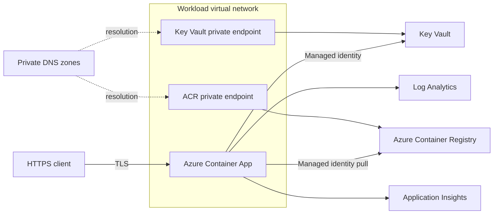
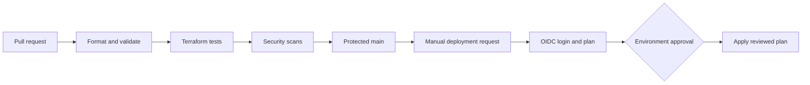

# Secure Azure Application Platform with Terraform

A production-oriented reference implementation for deploying an Azure Container Apps platform with private platform services, passwordless workload access, centralized observability, and approval-gated infrastructure delivery.

> Portfolio note: this repository is a fully synthetic reference implementation. It contains no production data, tenant identifiers, subscription identifiers, credentials, or code copied from a commercial environment.

## What this demonstrates

| Capability | Implementation |
|---|---|
| Infrastructure as Code | Reusable Terraform modules and environment-specific composition |
| Azure networking | VNet integration, delegated subnets, NSGs, Private DNS and Private Endpoints |
| Identity | User-assigned managed identity and Azure RBAC |
| Secrets | Key Vault with RBAC, purge protection and public access disabled |
| Container delivery | Private ACR, digest-pinned image input and Azure Container Apps |
| Observability | Log Analytics, Application Insights and diagnostic settings |
| CI/CD | GitHub Actions validation plus manual plan/apply with OIDC |
| Security | Immutable actions, least privilege, IaC scanning and secret detection |

## Architecture



The application endpoint is HTTPS-only. Platform dependencies are reachable through private endpoints. The application authenticates with a managed identity; ACR administrative credentials are disabled.

## Delivery flow



Cloud deployment is deliberately manual. A push to this repository cannot create Azure resources.

## Repository layout

| Path | Purpose |
|---|---|
| `modules/networking` | VNet, subnets, NSGs and Private DNS |
| `modules/observability` | Log Analytics and Application Insights |
| `modules/key_vault` | Private, RBAC-enabled Key Vault |
| `modules/registry` | Private Premium ACR and diagnostics |
| `modules/container_platform` | Container Apps environment and reference API |
| `environments` | Safe examples; real values are ignored |
| `tests` | Native Terraform tests with mocked providers |
| `scripts` | Strict-mode validation and planning helpers |
| `docs/wiki` | Source-controlled content published to GitHub Wiki |

## Security boundaries

| Boundary | Control |
|---|---|
| CI to Azure | GitHub OIDC federation; no stored Azure password |
| Workload to ACR | `AcrPull` assigned to the workload identity |
| Workload to Key Vault | `Key Vault Secrets User`; no access policy |
| Public to application | TLS-only ingress and optional CIDR allowlist |
| VNet to PaaS | Private endpoint and private DNS resolution |
| State storage | Azure AD authentication and an environment-specific state key |

## Prerequisites

- Terraform `1.15.8`
- Azure CLI authenticated to a non-production subscription
- An Azure Storage backend with Azure AD authorization
- An immutable OCI image reference such as `registry.example/api@sha256:<digest>`

No Azure access is required for formatting, validation, or the mocked tests.

## Quick start

```bash
cp environments/dev.tfvars.example environments/dev.tfvars
cp environments/backend.hcl.example environments/backend.hcl

# Replace placeholder values, then run offline checks.
./scripts/validate.sh

# Planning requires Azure authentication and an initialized backend.
./scripts/plan.sh dev
```

Real `*.tfvars`, backend files, plans and state are intentionally excluded from Git.

## Environment strategy

| Environment | Deployment trigger | Approval | Recommended state key |
|---|---|---|---|
| `dev` | Manual dispatch | Optional | `azure-secure-platform/dev.tfstate` |
| `stage` | Manual dispatch | Required | `azure-secure-platform/stage.tfstate` |
| `prod` | Manual dispatch | Required reviewers | `azure-secure-platform/prod.tfstate` |

Use separate subscriptions for production isolation. Do not promote state files; promote the same reviewed commit and immutable container digest.

## Validation

```bash
terraform fmt -check -recursive
terraform init -backend=false -input=false
terraform validate
terraform test
```

CI additionally runs TFLint, Trivy configuration scanning, Gitleaks and workflow linting.

## Cost and limitations

- Premium ACR and always-on Container Apps replicas incur cost.
- Zone redundancy is disabled in the demo to keep regional prerequisites simple; enable it for production after confirming regional capacity.
- The example does not provision DNS for a custom domain or an application gateway.
- Applying this project creates billable Azure resources. Review the plan and set budgets before deployment.

## Documentation

The GitHub Wiki covers architecture, modules, RBAC, remote state, CI/CD, private networking, operations and disaster recovery. Source copies live in [`docs/wiki`](docs/wiki) so documentation changes are reviewable.

## License

MIT — see [LICENSE](LICENSE).
