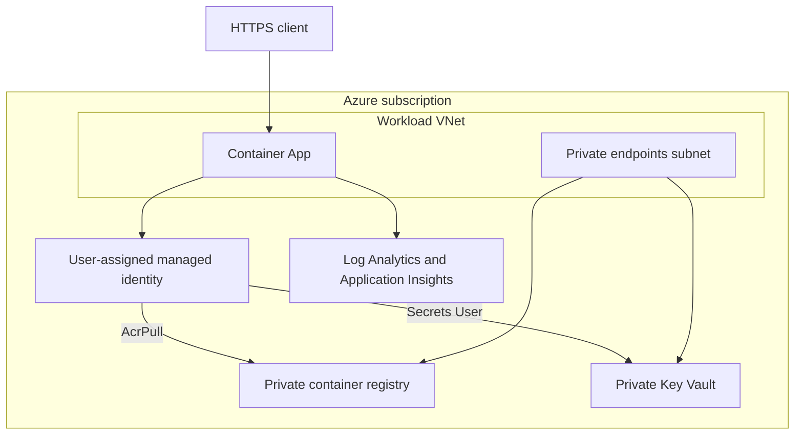

# Architecture

## Component view

## Design qualities

| Quality | Mechanism |
|---|---|
| Confidentiality | Private endpoints, TLS-only ingress, no registry admin user |
| Integrity | Digest-pinned images and reviewed Terraform plans |
| Availability | Autoscaling range and platform health probes |
| Auditability | Central diagnostics and immutable Git history |
| Maintainability | Small modules with explicit contracts |

The application is public by design; dependencies are not. For a fully private application, set internal ingress and place an approved gateway in front of the environment.
