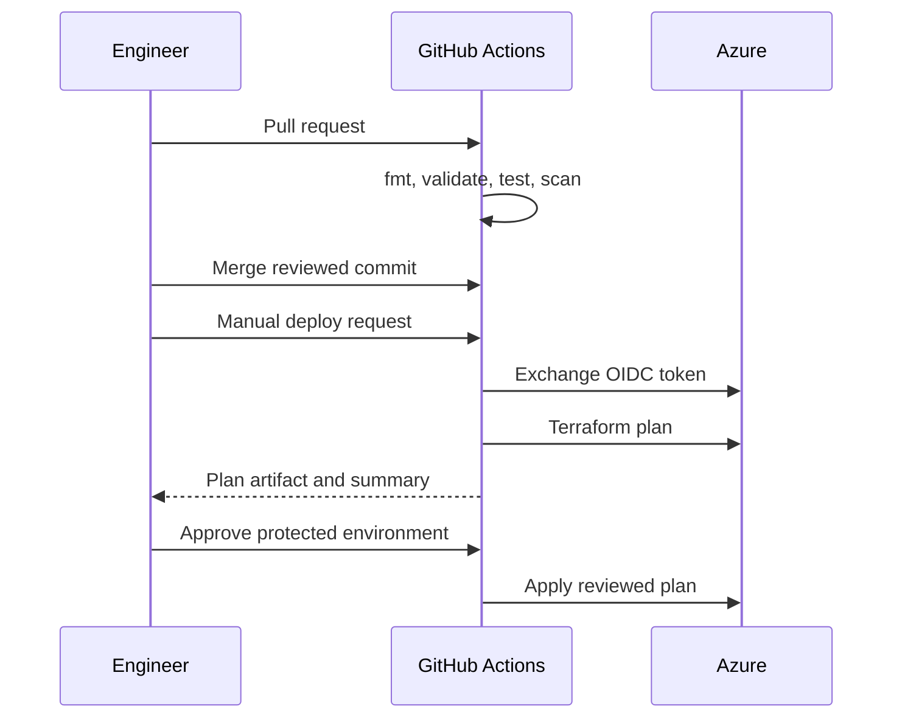

# CI/CD

| Workflow | Trigger | Cloud access |
|---|---|---|
| `ci.yml` | Pull request and main push | None |
| `deploy.yml` | Manual dispatch | OIDC, environment scoped |

The apply job downloads the exact plan generated for the same commit. Concurrency prevents overlapping changes to one environment.
