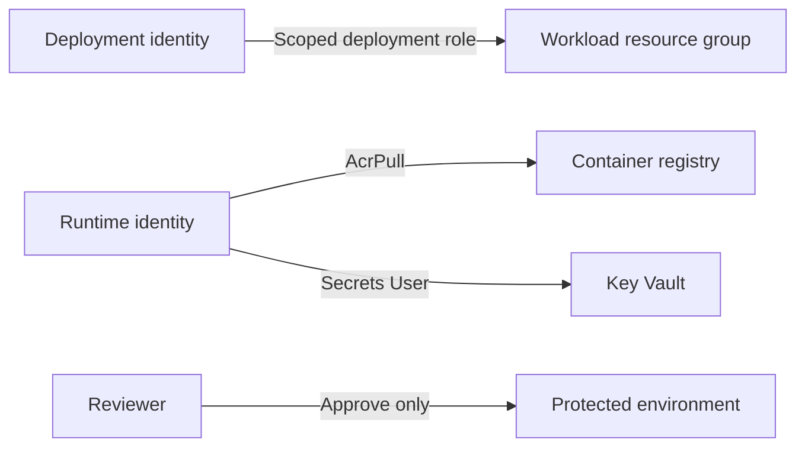

# RBAC

| Identity | Data-plane access | Control-plane access |
|---|---|---|
| Deployment identity | None by default | Required resource types in workload scope |
| Runtime identity | Pull images, read approved secrets | None |
| Reviewer | None | Approves a deployment job |

Production should use a custom deployment role instead of broad Contributor rights.
