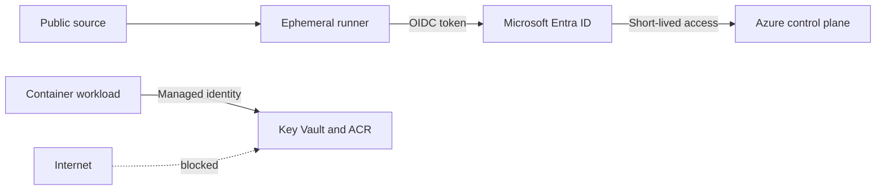

# Security

## Trust boundaries

## Required controls

| Control | Requirement |
|---|---|
| Workflow permissions | Read-only by default; `id-token: write` only for deployment jobs |
| Federation subject | Restrict to repository and protected environment |
| Azure role | Custom or least-privilege deployment role |
| State | Encryption, versioning, RBAC and network restrictions |
| Images | Immutable digest and vulnerability scan before deployment |
| Secrets | Runtime retrieval from Key Vault; never Terraform outputs |

Security scanners reduce risk but do not replace threat modeling and review.
